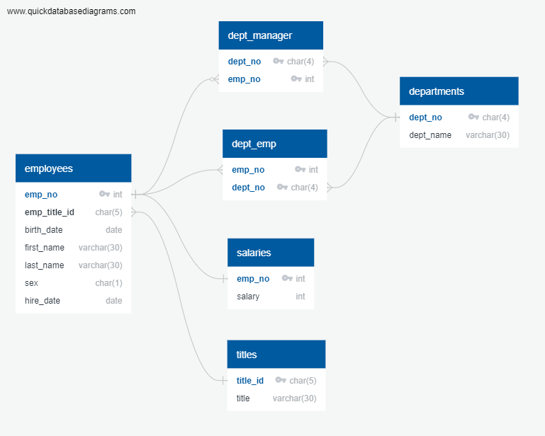
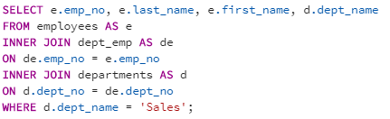
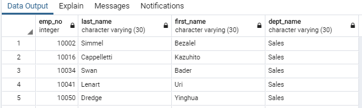
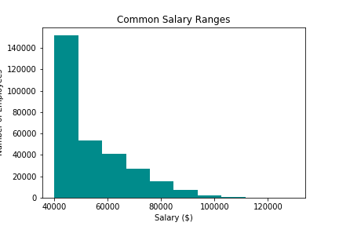
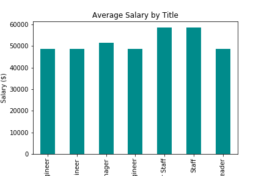

## sql-challenge

## Background

Project objectives:    
* Use postgresql to create a relational database holding 6 tables of employee data
* Then query database to view employee data based on different criteria
* Load database into pandas for further data analysis and visualization using sqlalchemy and matplotlib in Jupyter Notebook

## Defining the relationships between tables

**Key consideration**
As the employee data covers a relatively long period of time (1980s-1990s), it is likely that an employee who stayed long enough with the company would have worked in different deparments or held different titiles due to transfer or promotion over time. Such employees would have multiple records in tables. Relationships between tables should reflect this.

The following ERD generated by [Quick Database Diagrams](http://www.quickdatabasediagrams.com) gives an overview of how the tables are related to each other:

## Data analysis
A number of queries were then run on pgAdmin 4 to view different employee records.

Here is a sample query:

And here is the corresponding data output:

## Additional data visualization
Finally, to gain a more in-depth understanding of employees' salary data, further analyses were conducted.

Specifically, the 10 most common salary ranges of all employees were plotted in a histogram:

And employees' average salary by each title was shown in a bar chart:

